# Lost-and-found Mobile Application
Overview

A mobile application that helps users report, search, and reconnect with their lost items.
Built as a self-learned project to explore mobile app development and backend integration.

## Tech Stack

Frontend: React Native (Expo)

Backend: Node.js, Express.js

Database: MongoDB Atlas

Authentication: JWT (JSON Web Token)

Version Control: Git & GitHub

Backend hosting: Render

## Features

🔑 User signup & login

📍 Location-based search for lost/found items

📝 Post details of lost or found items

💬 Chat between item owner and finder

📂 Image upload for items

🔎 Search by title or category

## Screenshots
 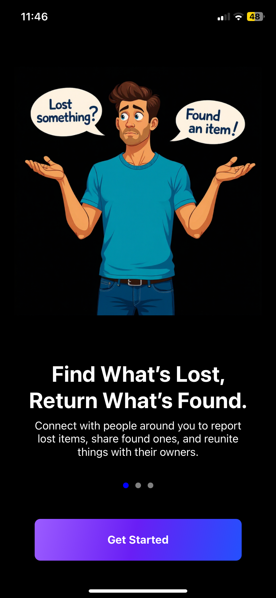 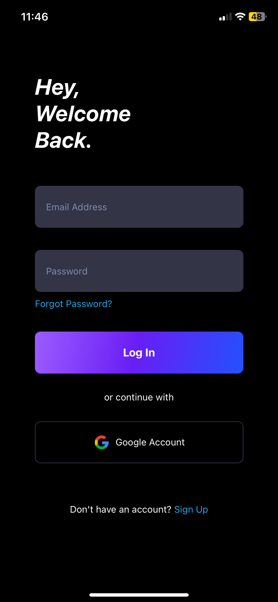
 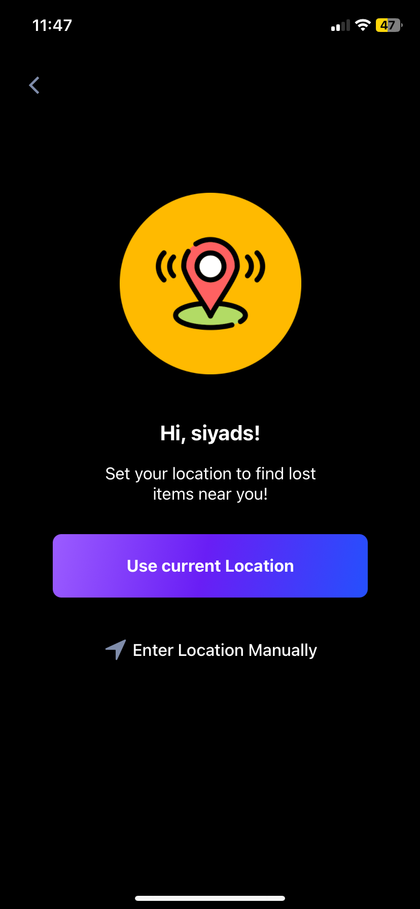 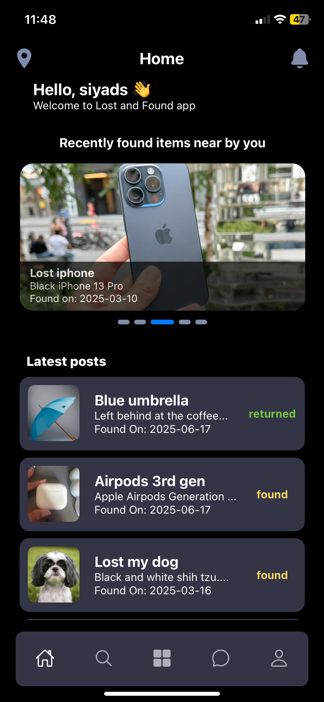
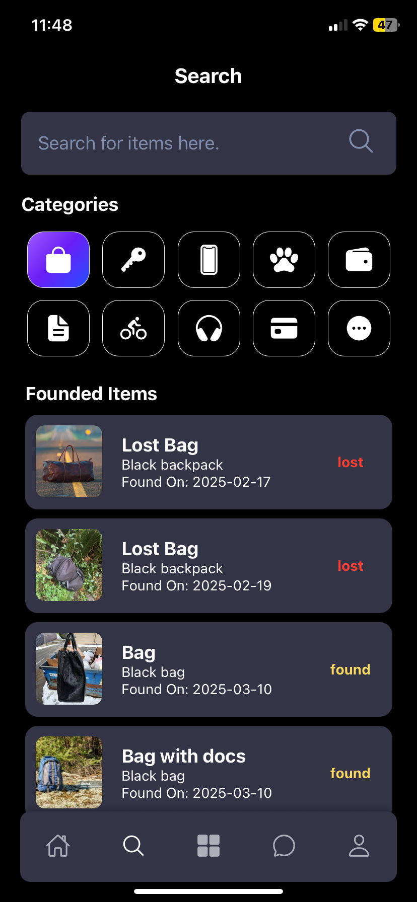 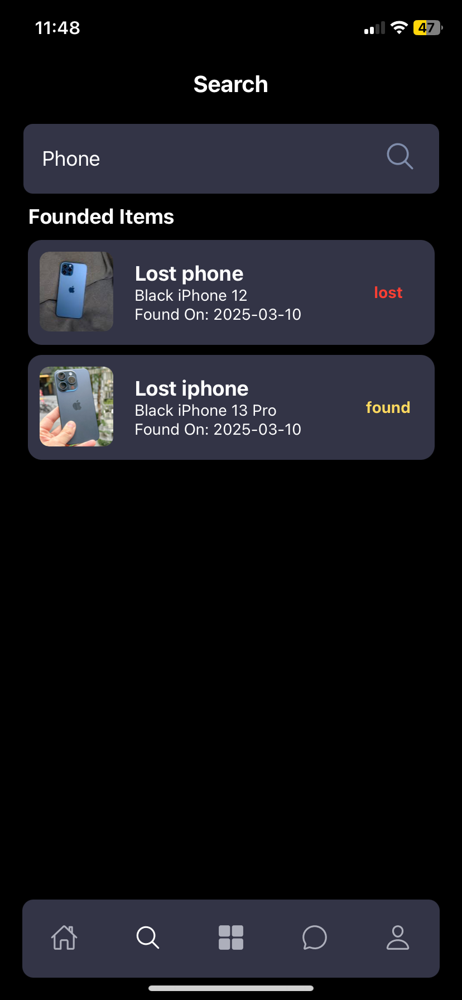 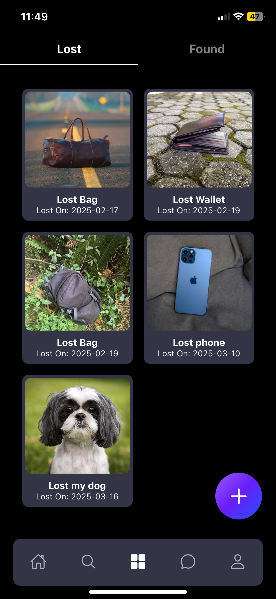
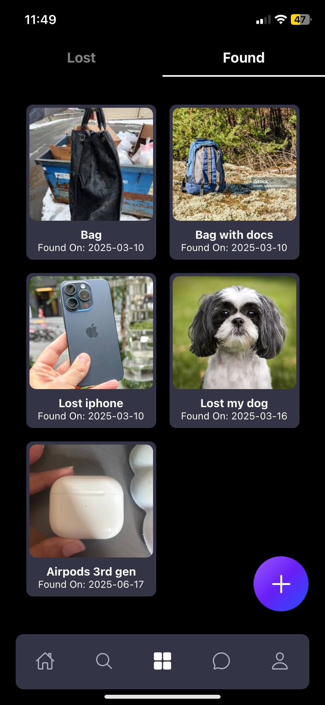 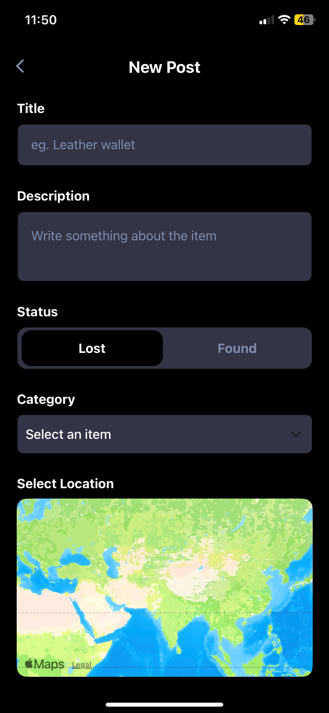 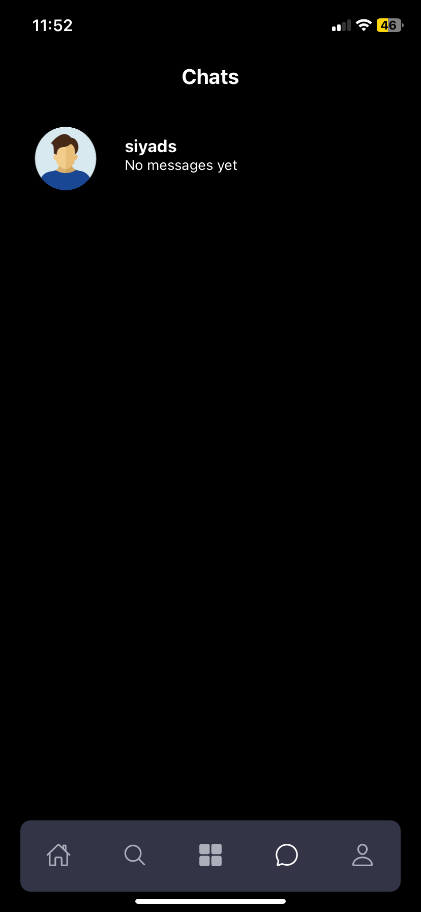
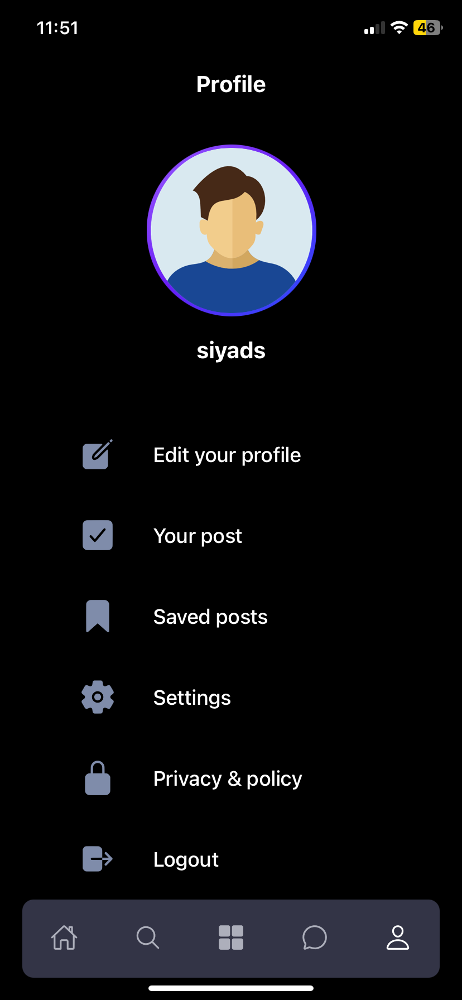 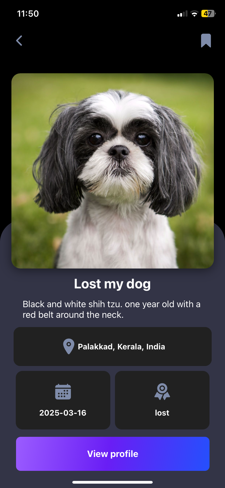 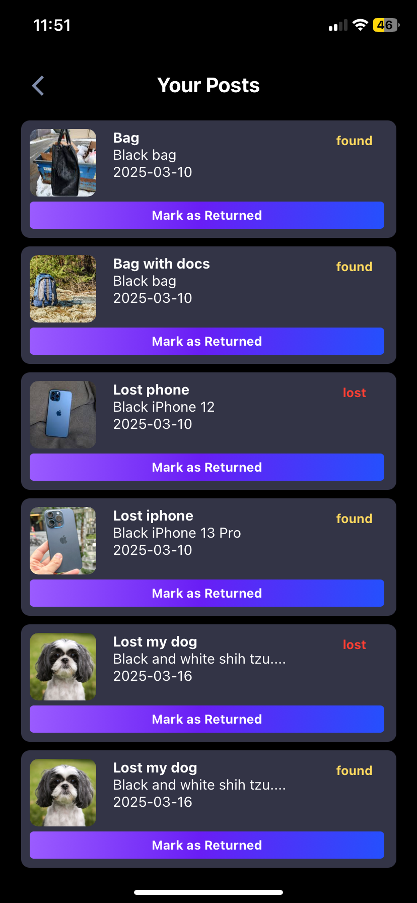
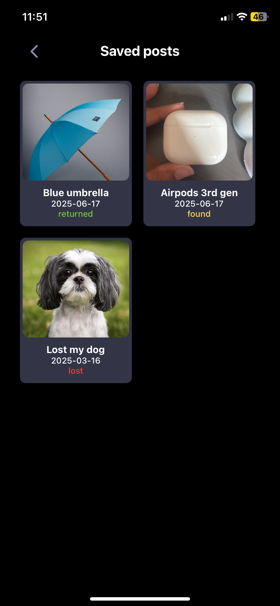

## Acknowledgements

This is a self-learned project built to practice and enhance my skills in mobile and backend development.